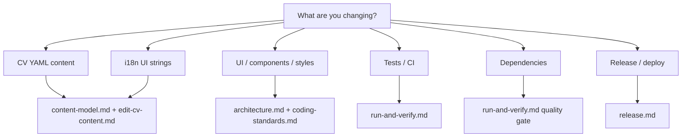

# AI context — CV site

**Entry point for agents.** Read this file first, then load only what the task
needs.

## Load order

| Priority | File                                         | When                                    |
| -------- | -------------------------------------------- | --------------------------------------- |
| 1        | [architecture.md](./architecture.md)         | Always — system map, build, deploy      |
| 2        | [coding-standards.md](./coding-standards.md) | Before writing code                     |
| 3        | [content-model.md](./content-model.md)       | Editing CV YAML or i18n                 |
| 4        | [workflows/](./workflows/)                   | Multi-step tasks                        |
| 5        | [../projects/](../projects/)                 | Active initiatives (e.g. stack rewrite) |

## Active projects

| Project                                                                     | Status                                                                             |
| --------------------------------------------------------------------------- | ---------------------------------------------------------------------------------- |
| [next-shadcn-supabase-rewrite](../projects/next-shadcn-supabase-rewrite.md) | planning — Next + shadcn + Supabase; GitHub Pages on `v2`; Supabase webhook deploy |

## Agent roles

| Role                 | Focus                                                          |
| -------------------- | -------------------------------------------------------------- |
| **Dependency Agent** | npm updates in controlled batches; `npm outdated` + validation |
| **Quality Agent**    | `npm ci`, lint, typecheck, generate before PR                  |
| **CI Agent**         | GitHub Actions workflows — fast, reliable checks               |
| **Release Agent**    | semantic-release, tag workflow, publish                        |

See also root [`SKILLS.md`](../../SKILLS.md) for working agreements.

## Deep reference (load on demand)

| File                                                       | Scope                           |
| ---------------------------------------------------------- | ------------------------------- |
| [../content.md](../content.md)                             | Human-facing CV editing guide   |
| [../setup.md](../setup.md)                                 | Local dev setup                 |
| [../references.md](../references.md)                       | URLs, CI secrets, external docs |
| [workflows/commit-and-pr.md](./workflows/commit-and-pr.md) | Commits and PRs                 |
| [workflows/release.md](./workflows/release.md)             | Tag-based deploy                |

## Repository map

```
cv/
├── app/                    # Nuxt app (single page: app.vue)
│   ├── components/         # Header, Experience, Education, Skills, Hobbies, ui/
│   ├── assets/styles/      # SCSS tokens, mixins, Tailwind helpers
│   └── types/cv.ts         # Zod schema (source of truth)
├── content/*.yaml          # CV data
├── i18n/locales/           # UI strings (en, hu)
├── config.ts               # Site URL, meta, active CV filename
├── nuxt.config.ts          # Modules, static preset, i18n
├── tests/                  # Playwright E2E + visual
├── .github/workflows/      # CI, publish, release
└── docs/                   # This documentation tree
```

## Hard rules

- **Flow diagrams → Mermaid** — not ASCII box art in fenced blocks
  ([coding-standards.md](./coding-standards.md#documentation)).
- **Minimize diff** — change only what the task requires.
- **No commits** unless explicitly asked.
- **No secrets** in git — use GitHub Secrets / env vars.
- **Match existing patterns** before adding abstractions.
- **Tailwind sizing in SCSS** — use `tw-spacing()`, `var(--color-*)`,
  `var(--text-*)` from `_tailwind.scss`; do not use `@apply` in `.scss` files
  (Tailwind v4 incompatibility).

## Quick facts

|              | Value                                                      |
| ------------ | ---------------------------------------------------------- |
| Framework    | Nuxt 4, Vue 3, TypeScript                                  |
| Output       | Static (`.output/public`) via `npm run generate`           |
| Node         | ≥ 24.18.0                                                  |
| Active CV    | `content/gabor-pichner.yaml` (`config.ts` → `cv.filename`) |
| Locales      | `en` (default), `hu`                                       |
| Dev URL      | http://localhost:3000                                      |
| Quality gate | `npm ci` → lint → typecheck → generate                     |

## Task routing


