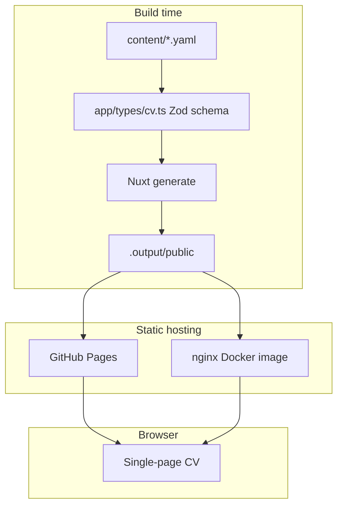
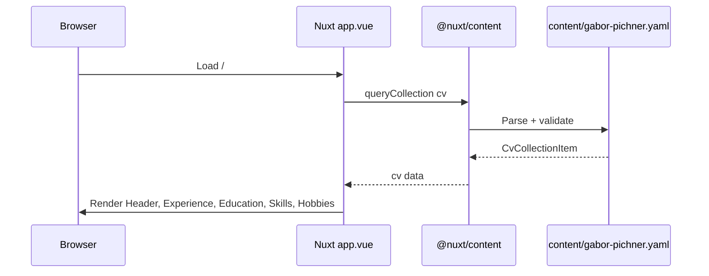
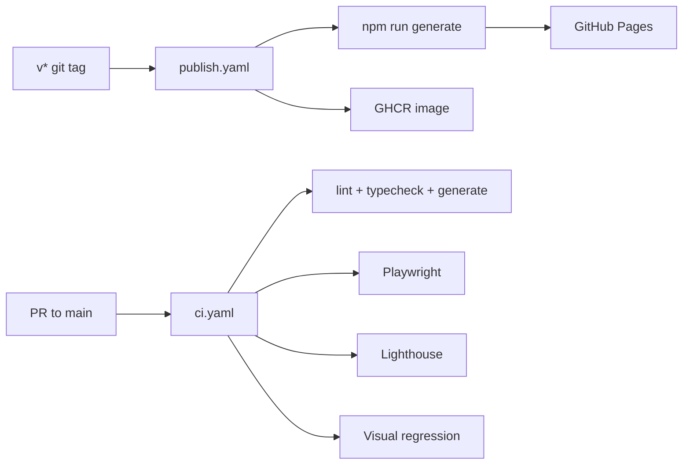

# Architecture

## System context

## Component responsibilities

| Layer                   | Owns                                                 | Does NOT own           |
| ----------------------- | ---------------------------------------------------- | ---------------------- |
| **`content/*.yaml`**    | CV data (personal, jobs, education, skills, hobbies) | UI labels, routing     |
| **`config.ts`**         | Site URL, SEO meta, which CV file to load            | CV field content       |
| **`i18n/locales/`**     | Section titles, buttons, employment type labels      | CV body text           |
| **`app/app.vue`**       | Page shell, loading skeleton, data fetch             | Section markup details |
| **`app/components/*`**  | Section rendering, SCSS                              | Global site config     |
| **`@nuxt/content`**     | YAML parse + schema validation                       | Visual design          |
| **Nitro static preset** | Prerender all routes                                 | Server runtime         |

## Request / data flow

No `pages/` directory — `app/app.vue` is the sole entry. i18n uses
`prefix_except_default` (`/` = en, `/hu` = Hungarian).

## Key paths

| Task             | Path                                                               |
| ---------------- | ------------------------------------------------------------------ |
| Change CV data   | `content/gabor-pichner.yaml`                                       |
| Switch CV file   | `config.ts` → `siteConfig.cv.filename`                             |
| CV schema        | `app/types/cv.ts`                                                  |
| Site meta / URL  | `config.ts`                                                        |
| Global SCSS      | `app/assets/styles/main.scss`, `_variables.scss`, `_tailwind.scss` |
| Component styles | `app/components/<Name>/<Name>.scss`                                |
| UI strings       | `i18n/locales/en.json`, `hu.json`                                  |
| E2E tests        | `tests/`                                                           |
| CI               | `.github/workflows/ci.yaml`                                        |
| Deploy           | `.github/workflows/publish.yaml` (on `v*` tag)                     |

## Modules (nuxt.config.ts)

| Module                              | Role                               |
| ----------------------------------- | ---------------------------------- |
| `@nuxt/content`                     | YAML collections + Zod validation  |
| `@nuxt/ui`                          | UCard, UContainer, design system   |
| `@nuxtjs/i18n`                      | en/hu routing and messages         |
| `@nuxtjs/sitemap`, `@nuxtjs/robots` | SEO                                |
| `nuxt-llms`                         | llms.txt generation                |
| `@nuxt/scripts`                     | Google Analytics (production only) |

## Styling architecture

- **Tailwind v4** via `@nuxt/ui` — utility classes in templates where
  appropriate.
- **SCSS** for component-specific styles — use Tailwind theme tokens
  (`tw-spacing()`, `var(--color-*)`), not `@apply` in `.scss` files.
- Vite `additionalData` injects `_variables.scss`, `_mixins.scss`,
  `_tailwind.scss` globally.

## Build and deploy

## Static output

- `nitro.preset: 'static'`
- Production command: `npm run generate` (not `npm run build` for Pages deploy)
- Preview: `npx serve .output/public` or `npm run preview`
