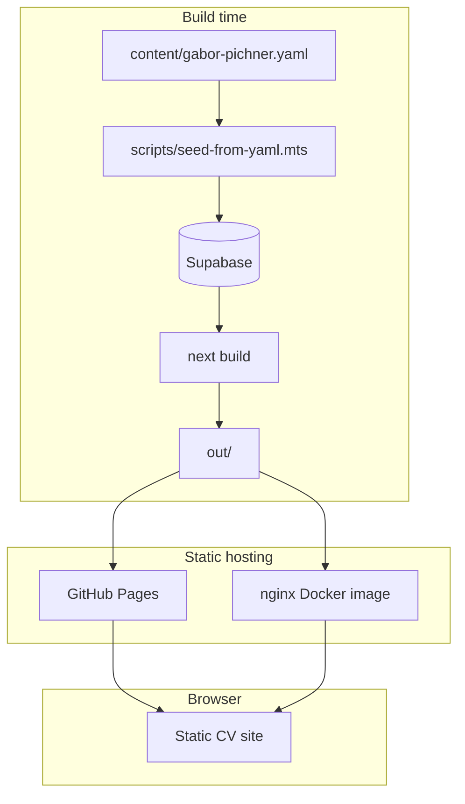
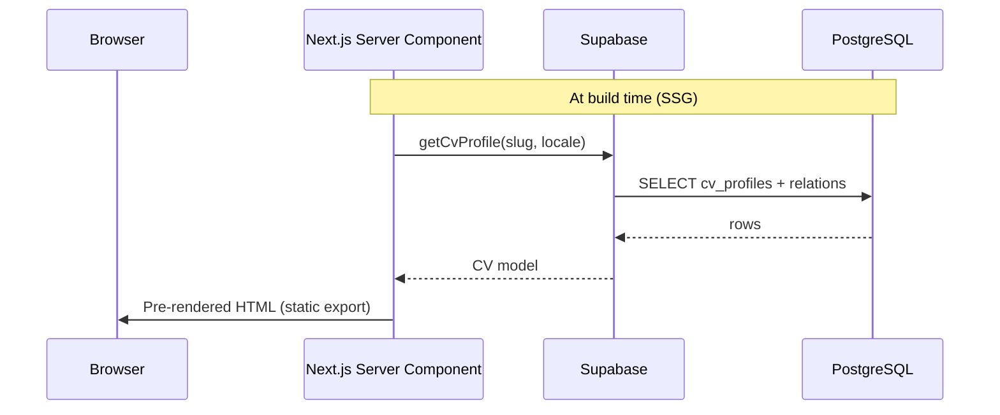
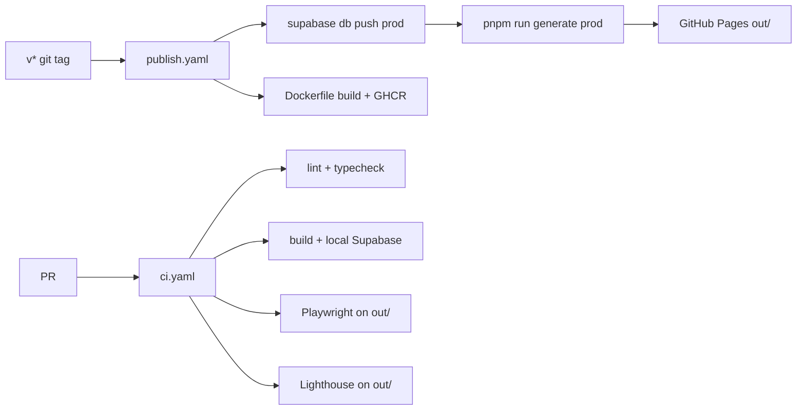

# Architecture

## System context

## Component responsibilities

| Layer                      | Owns                                   | Does NOT own                                        |
| -------------------------- | -------------------------------------- | --------------------------------------------------- |
| **`content/*.yaml`**       | Source CV data for seeding             | Runtime reads (Supabase is runtime source at build) |
| **`supabase/migrations/`** | DB schema                              | UI                                                  |
| **`lib/cv/*`**             | Types, DB mapping, `getCvProfile()`    | React markup                                        |
| UI strings / i18n          | `messages/`, `i18n/`, `next-intl`      | CV body text                                        |
| **`components/*`**         | Section rendering, client widgets      | Global routing                                      |
| **`app/`**                 | Routes (`/`, `/hu`), metadata, sitemap | Section details                                     |
| **`lib/seo/*`**            | Metadata, JSON-LD, llms.txt content    | Visual design                                       |

## Request / data flow

Routes: `/` (English), `/hu` (Hungarian). No client-side CV fetch in production.

## Key paths

| Task                   | Path                                                  |
| ---------------------- | ----------------------------------------------------- |
| Change CV data (local) | Edit YAML → `pnpm run db:seed`                        |
| Change CV data (prod)  | Edit YAML → `pnpm run db:seed` (cloud env) → `v*` tag |
| CV types               | `lib/cv/types.ts`                                     |
| DB mapping             | `lib/cv/map-from-db.ts`                               |
| Fetch at build         | `lib/cv/fetch.ts`                                     |
| Site meta / URL        | `lib/site-config.ts`                                  |
| UI strings (i18n)      | `messages/`, `i18n/`, `next-intl`                     |
| Docker prod image      | Root `Dockerfile` (build inside Docker + nginx)       |
| Global styles          | `app/globals.css`                                     |
| Components             | `components/*.tsx`, `components/ui/`                  |
| SEO                    | `lib/seo/`, `app/sitemap.ts`, `app/robots.ts`         |
| E2E tests              | `tests/e2e/`                                          |
| CI                     | `.github/workflows/ci.yaml`                           |
| Deploy                 | `.github/workflows/publish.yaml` (on `v*` tag)        |

## Styling

- **Tailwind CSS v4** via `app/globals.css` (`@import 'tailwindcss'`).
- **shadcn/ui** components in `components/ui/`.
- Utility classes in TSX; shared layout tokens as `.cv-*` classes in
  `globals.css`.
- **No `@apply` in SCSS** — legacy Nuxt SCSS removed; use Tailwind utilities or
  `.cv-*` helpers in `app/globals.css`.
- Dark/light theme via `.dark` on `<html>` (`next-themes`).

## Build and deploy

## Static output

- `next.config.ts`: `output: 'export'`, `images.unoptimized: true`
- Build command: `pnpm run build` (alias: `pnpm run generate`)
- Output directory: `out/`
- Preview: `npx http-server out -p 4173`

## Environment variables

| Variable                   | Purpose                                                                |
| -------------------------- | ---------------------------------------------------------------------- |
| `SUPABASE_URL`             | Build-time Supabase API URL                                            |
| `SUPABASE_PUBLISHABLE_KEY` | Build-time read (RLS); legacy fallback: `SUPABASE_ANON_KEY`            |
| `SUPABASE_SECRET_KEY`      | Seed writes only (local); legacy fallback: `SUPABASE_SERVICE_ROLE_KEY` |
| `NEXT_PUBLIC_SITE_URL`     | Canonical URL, sitemap, OG                                             |
| `NEXT_PUBLIC_GA_ID`        | Google Analytics (production)                                          |

See `.env.example`.
