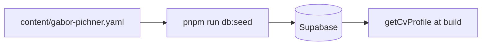

# Content model

CV data schema, localization, and validation rules.

## Data flow



**Source of truth for editing:** `content/gabor-pichner.yaml` (seed into DB).  
**Source of truth for types:** `lib/cv/types.ts`.

## Top-level shape

```typescript
{
  personal: Personal,
  workExperience: WorkExperience[],
  educations: Education[],
  skills: Skill[],
  hobbies: Hobby[],
}
```

## Localization

Type: `Record<'en' | 'hu', string>` for user-facing CV text fields.

| Layer      | Location                                               | Example                                        |
| ---------- | ------------------------------------------------------ | ---------------------------------------------- |
| CV content | DB / YAML                                              | `title.en`, `title.hu`                         |
| UI chrome  | `messages/en.json`, `messages/hu.json` via `next-intl` | `cv.workExperience`, `experience.technologies` |

Routing: English at `/`, Hungarian at `/hu`.

## Field reference

### `personal`

| Field           | Type                                   | Notes                |
| --------------- | -------------------------------------- | -------------------- |
| `name`, `title` | LocalizedString                        | Required both langs  |
| `picture`       | string                                 | Path under `public/` |
| `links[]`       | platform, url, icon.dark/light         | Social icons         |
| `contact[]`     | type: location/phone/email/link, value | Header contact row   |

### `workExperience[]`

| Field            | Type                | Notes                        |
| ---------------- | ------------------- | ---------------------------- |
| `title`          | LocalizedString     | Job title                    |
| `company`        | name, optional link |                              |
| `employmentType` | string              | e.g. `full-time`, `contract` |
| `location`       | string              |                              |
| `from`, `end`    | `{ year?, month? }` | `end` omitted = present      |
| `description`    | LocalizedString     |                              |
| `technologies[]` | name, link          |                              |

### `educations[]`, `skills[]`, `hobbies[]`

See `lib/cv/types.ts` and `content/example.yaml`.

## Site config

`lib/site-config.ts` — URL, SEO defaults, `cv.slug` (default: `gabor-pichner`).

Optional DB override: `site_config` table via `lib/get-site-config.ts`.

## Editing workflow

1. Edit `content/gabor-pichner.yaml`.
2. `pnpm run db:seed` (local or prod Supabase env).
3. `pnpm run dev` or `pnpm run build` to verify.
4. Prod: push `v*` tag after seeding cloud DB.

## Do not

- Put UI labels in YAML — use `messages/*.json`.
- Commit secrets or `.env.local`.
- Edit `lib/supabase/types.ts` by hand — use `pnpm run db:types`.
