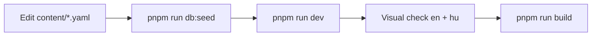

# Workflow: edit CV content

Human guide: [`../../content.md`](../../content.md)  
Schema: [../content-model.md](../content-model.md)

## Before editing

1. Read [content-model.md](../content-model.md).
2. Use `content/example.yaml` as reference.
3. Active slug: `lib/site-config.ts` → `cv.slug` (default: `gabor-pichner`).

## Edit flow



## Checklist

- [ ] Localized fields have `en` and `hu`
- [ ] Period dates valid (`year` required, `month` 1–12 if set)
- [ ] Asset paths exist under `public/`
- [ ] UI strings in `messages/` only if changing chrome labels

## New CV profile

1. Copy `content/example.yaml` → `content/<slug>.yaml`
2. Add seed logic or extend `scripts/seed-from-yaml.mts` for the new slug
3. Update `lib/site-config.ts` → `cv.slug`
4. Replace `public/` assets as needed

## Verify

```bash
pnpm run db:seed
pnpm run dev
pnpm run build
```

## Do not

- Put UI labels in YAML (use `messages/`)
- Commit unless user asked
