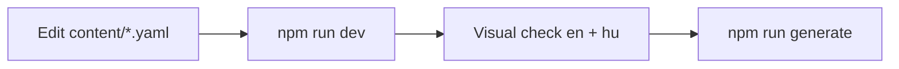

# Workflow: edit CV content

Human guide: [`../../content.md`](../../content.md)  
Schema: [../content-model.md](../content-model.md)

## Before editing

1. Read [content-model.md](../content-model.md) for field shapes.
2. Use `content/example.yaml` as reference.
3. Confirm active file: `config.ts` → `cv.filename` (default: `gabor-pichner`).

## Edit flow



## Checklist

- [ ] All localized fields have `en` and `hu`
- [ ] `technologies[].link` present for each item
- [ ] Period dates valid (`year` required, `month` 1–12 if set)
- [ ] Asset paths exist under `public/` (pictures, icons)
- [ ] UI strings unchanged unless needed → `i18n/locales/`

## New CV file (fork)

1. Copy `content/example.yaml` → `content/<slug>.yaml`
2. Update `config.ts` → `cv.filename: '<slug>'`
3. Align `app/app.vue` query `stem` with slug (if hardcoded)
4. Update `config.ts` site meta (title, URL, favicon)
5. Replace `public/` assets

## Verify

```bash
npm run dev          # hot reload check
npm run generate     # schema validation at build
```

## Do not

- Put UI labels in YAML (use `i18n/locales/`)
- Edit `schema/cv.schema.json` manually
- Commit unless user asked
