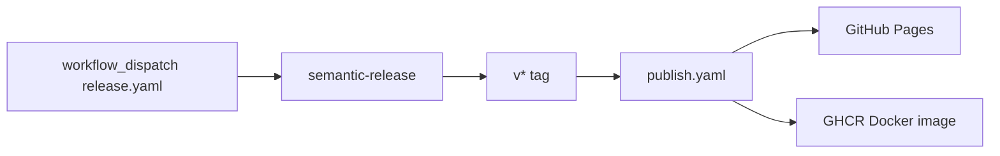

# Workflow: release

## Overview



## Manual release

1. Ensure `main` is green (CI passed).
2. GitHub Actions → **Release** workflow → `workflow_dispatch`.
3. Requires `RELEASE_BOT_GITHUB_TOKEN` secret.
4. semantic-release creates version tag + changelog.

## Tag deploy (automatic after release)

`publish.yaml` triggers on `v*` tags:

- `npm run generate` → deploy `.output/public` to GitHub Pages
- Build and push multi-arch Docker image to `ghcr.io/95gabor/cv`

## Local preview of production output

```bash
npm run generate
npx serve .output/public
# or
docker compose up --build   # port 8000
```

## Versioning

- Tool: semantic-release + Conventional Commits
- Changelog: `CHANGELOG.md` (auto-updated)
- Current version: `package.json` → `version`

## Agent rules

- Do not create releases unless explicitly asked.
- Do not force-push tags.
- Release Agent owns dependency of release workflow changes.
