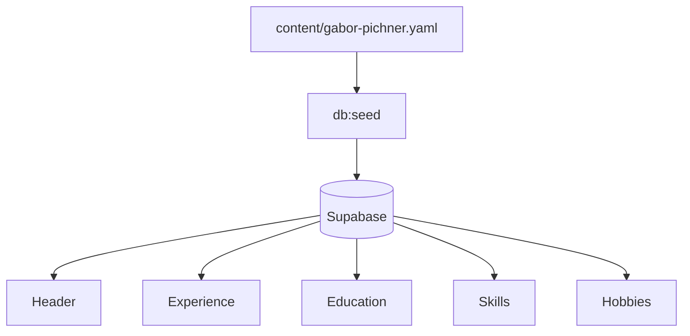

# Editing CV content

> Agent workflow:
> [`.ai/workflows/edit-cv-content.md`](./.ai/workflows/edit-cv-content.md)  
> Schema: [`.ai/content-model.md`](./.ai/content-model.md)

## Which file to edit?

| File                                   | When                                    |
| -------------------------------------- | --------------------------------------- |
| `content/gabor-pichner.yaml`           | CV data (default profile)               |
| `content/example.yaml`                 | Template / reference                    |
| `lib/site-config.ts` → `cv.slug`       | Which profile to load (`gabor-pichner`) |
| `messages/en.json`, `messages/hu.json` | UI strings — **not** CV body text       |

After YAML edits, run `pnpm run db:seed` to update local Supabase.

## Bilingual model

CV fields use `en` and `hu` keys:

```yaml
personal:
  name:
    en: Gábor Pichner
    hu: Pichner Gábor
  title:
    en: Senior TypeScript Full-Stack Developer
    hu: Senior TypeScript Full-Stack Fejlesztő
```

The language switcher navigates `/` ↔ `/hu`; content renders the matching locale
field.

## Main sections



## Common fields

### Personal (`personal`)

- `picture` — path under `public/` (e.g. `/pictures/avatars/gabor-pichner.png`)
- `links` — social links with icon pairs (`dark` / `light`)
- `contact` — `location`, `phone`, `email`, `link` types

### Work experience (`workExperience`)

```yaml
- title:
    en: Full Stack Developer
    hu: Full Stack fejlesztő
  company:
    name: Example Ltd
    link: https://example.com
  location: Budapest, HU
  from: { year: 2024, month: 1 }
  end: { year: 2025, month: 6 }
  description:
    en: ...
    hu: ...
  technologies:
    - name: TypeScript
      link: https://www.typescriptlang.org/
```

### Skills / hobbies

Skills: `name`, optional `link`.  
Hobbies: localized `name.en` / `name.hu`, optional `link`.

## Validation

- Types: `lib/cv/types.ts`
- Seed script validates while inserting: `scripts/seed-from-yaml.mts`
- Full build check: `pnpm run build`

## UI strings (not in YAML)

Section titles, employment type labels, cookie banner — `messages/en.json` and
`messages/hu.json`.
