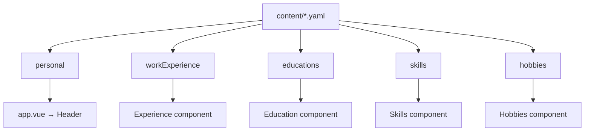

# Editing CV content

> Agent workflow:
> [`.ai/workflows/edit-cv-content.md`](./.ai/workflows/edit-cv-content.md)  
> Schema details: [`.ai/content-model.md`](./.ai/content-model.md)

## Which file to edit?

| File                              | When                                                                |
| --------------------------------- | ------------------------------------------------------------------- |
| `content/gabor-pichner.yaml`      | Your CV data (default)                                              |
| `content/example.yaml`            | Template / reference for another CV                                 |
| `config.ts` → `cv.filename`       | Which YAML to load (`gabor-pichner` → `content/gabor-pichner.yaml`) |
| `i18n/locales/en.json`, `hu.json` | UI strings (section titles, buttons) — **not** CV body content      |

## Bilingual model

CV fields use `en` and `hu` keys:

```yaml
personal:
  name:
    en: Gábor Pichner
    hu: Pichner Gábor
  title:
    en: Senior TypeScript Full-Stack Developer
    hu: Senior TypeScript Full-Stack Fejlesztő
```

The language switcher uses i18n; content renders the field matching the selected
locale.

## Main sections



## Common fields

### Personal (`personal`)

- `picture` — path under `public/` (e.g. `/pictures/avatars/gabor-pichner.png`)
- `links` — social links with icon pairs (`dark` / `light`)
- `contact` — `location`, `phone`, `email`, `link` types

### Work experience (`workExperience`)

```yaml
- title:
    en: Senior Developer
    hu: Senior Fejlesztő
  company:
    name: Example Ltd
    link: https://example.com # optional
  location: Budapest
  from:
    year: 2020
    month: 3 # optional
  end: # optional — omit for current role
    year: 2024
  employmentType: full-time # optional — i18n key
  description:
    en: >
      Multiline text...
    hu: >
      Többsoros szöveg...
  technologies:
    - name: TypeScript
      link: https://www.typescriptlang.org
```

### Education (`educations`)

Same period model (`from` / `end`); `degree` and `institution` are localized.

### Skills and hobbies

- `skills` — `name` + optional `link`
- `hobbies` — localized `name` + optional `link`

## Validation

Schema source: `app/types/cv.ts` (Zod). On build/content parse errors, check:

1. Every localized field has both `en` and `hu` values
2. `from.year` is required for experience/education entries
3. Technology objects: `name` + `link` (link is required in the schema)

Generated JSON Schema: `schema/cv.schema.json` (part of `npm run generate`).

## New CV file (fork)

1. Copy `content/example.yaml` → `content/<slug>.yaml`
2. `config.ts`: `cv.filename: '<slug>'`
3. Replace `public/` assets (avatar, favicon)
4. `npm run dev` — verify
