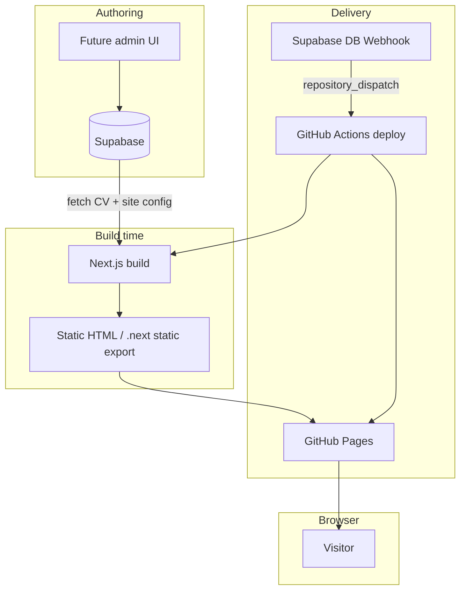
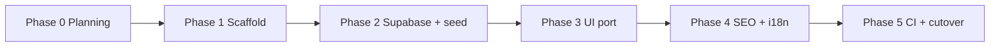

# Next.js + shadcn + Supabase rewrite

## Metadata

| Field             | Value                                                                                                       |
| ----------------- | ----------------------------------------------------------------------------------------------------------- |
| Slug              | `next-shadcn-supabase-rewrite`                                                                              |
| Status            | `planning`                                                                                                  |
| Goal              | Greenfield rewrite: modern React stack, **UI CV editor** (no JSON/YAML for authors), build-time static site |
| Baseline          | Current Nuxt 4 static site (`main` branch)                                                                  |
| Work branch       | **`v2`** — rewrite until cutover merge to `main`                                                            |
| Live URL          | https://95gabor.me                                                                                          |
| Effort (estimate) | 1–2 weeks focused implementation + CI port                                                                  |

## Summary

Replace the current **Nuxt 4 + YAML + @nuxt/content** architecture with:

| Layer     | Target                                                                         |
| --------- | ------------------------------------------------------------------------------ |
| Framework | **Next.js** (App Router)                                                       |
| UI        | **shadcn/ui** + **Tailwind CSS v4**                                            |
| Content   | **Supabase** (Postgres + Storage)                                              |
| Rendering | **SSG** — Supabase fetch at build time → static HTML (`out/`)                  |
| Deploy    | **GitHub Pages** from `v2` branch; `next build` with `output: 'export'`        |
| Rebuild   | **Supabase Database Webhook** → GitHub `repository_dispatch` → deploy workflow |

Content must **not** be fetched client-side on the public CV page. Supabase is
the source of truth for editable data; the production site remains static HTML
for performance and SEO.

## Why

| Driver           | Detail                                                                         |
| ---------------- | ------------------------------------------------------------------------------ |
| Stack alignment  | Next + React ecosystem; shadcn for composable UI                               |
| Editable content | **Form-based CV editor** → Supabase tables; developers see structured SQL rows |
| Simpler styling  | Tailwind-only (no SCSS + Tailwind v4 friction)                                 |
| Keep strengths   | SEO 100%, a11y ≥95%, sitemap, structured data, bilingual `/` + `/hu`           |

## Non-goals (v1 public site)

- **CV Editor UI** shipped in v1 (schema + seed first; editor follows on `v2`)
- Multi-tenant / multiple CVs per deployment
- Runtime SSR for the CV page
- Dropping bilingual support
- Dropping Lighthouse CI gates

## Target architecture



See [architecture detail](./next-shadcn-supabase-rewrite/architecture.md).

## Stack decisions

| Choice             | Decision                            | Rationale                                                        |
| ------------------ | ----------------------------------- | ---------------------------------------------------------------- |
| Next.js App Router | Yes                                 | `generateStaticParams`, Metadata API, `sitemap.ts` / `robots.ts` |
| shadcn/ui          | Yes                                 | Accessible primitives; copied into repo; Tailwind-native         |
| Tailwind CSS v4    | Yes                                 | Required by shadcn; layout + custom sections                     |
| SCSS               | No                                  | Avoid dual styling pipelines                                     |
| Supabase           | Yes                                 | Postgres for structured CV; Storage for images                   |
| Content fetch      | Build time only                     | Parity with current static site performance                      |
| Static export      | `output: 'export'`                  | Required for GitHub Pages                                        |
| Rebuild            | Supabase webhook → GitHub           | No ISR; full static rebuild on content change                    |
| Deploy             | GitHub Pages                        | Keep current hosting; deploy `out/`                              |
| Work branch        | `v2`                                | Nuxt stays on `main` until cutover                               |
| E2E                | Playwright                          | Port existing tests; smoke + locale switch                       |
| Supabase schema    | **Editor-first hybrid**             | Child tables + `_en`/`_hu` columns; no document JSONB            |
| Package manager    | **pnpm**                            | On `v2`; `main` stays npm until cutover                          |
| Local Supabase     | **CLI + Docker** (`supabase start`) | Dev/build against localhost; cloud for CI/prod                   |
| i18n               | `next-intl` or App Router locales   | Match `prefix_except_default` (`/` en, `/hu` hu)                 |

## Decisions (locked)

| #   | Topic           | Decision                                                                                                                            |
| --- | --------------- | ----------------------------------------------------------------------------------------------------------------------------------- |
| 1   | Deploy target   | **GitHub Pages**                                                                                                                    |
| 2   | Repo strategy   | **`v2` branch** until cutover merge to `main`                                                                                       |
| 3   | Rebuild trigger | **Supabase Database Webhook → GitHub `repository_dispatch`**                                                                        |
| 4   | E2E testing     | **Playwright** (keep current tooling)                                                                                               |
| 5   | Supabase schema | **Editor-first hybrid** — tables + `_en`/`_hu` columns; see [supabase-schema.md](./next-shadcn-supabase-rewrite/supabase-schema.md) |
| 6   | Package manager | **pnpm** (`pnpm-lock.yaml`, `packageManager` in `package.json`)                                                                     |
| 7   | Local Supabase  | **Self-hosted** via Supabase CLI + Docker; cloud for CI/prod                                                                        |

Detail: [deploy.md](./next-shadcn-supabase-rewrite/deploy.md) ·
[local-supabase.md](./next-shadcn-supabase-rewrite/local-supabase.md).

## Content authoring goal

| User      | Interface                                                           |
| --------- | ------------------------------------------------------------------- |
| CV owner  | Visual editor — forms, lists, uploads, EN/HU fields                 |
| Developer | Supabase SQL / typed `lib/cv/map-from-db.ts` — no opaque JSON blobs |
| Visitor   | Static HTML — unchanged performance model                           |

## SEO / quality parity

Must meet or exceed current CI thresholds:

| Metric          | Current gate                                | Target                                      |
| --------------- | ------------------------------------------- | ------------------------------------------- |
| Lighthouse SEO  | ≥ 100%                                      | ≥ 100%                                      |
| Lighthouse a11y | ≥ 95%                                       | ≥ 95%                                       |
| Structured data | JSON-LD Person + JobPosting                 | Port 1:1                                    |
| Meta            | title, description, keywords, OG, canonical | Metadata API                                |
| sitemap.xml     | `@nuxtjs/sitemap`                           | `app/sitemap.ts`                            |
| robots.txt      | `@nuxtjs/robots`                            | `app/robots.ts`                             |
| llms.txt        | `nuxt-llms`                                 | Static route or `public/llms.txt` generator |
| Analytics       | GA production only                          | `@next/third-parties` or equivalent         |

Full checklist: [seo-parity.md](./next-shadcn-supabase-rewrite/seo-parity.md).

## Data model

Supabase replaces `content/*.yaml`. Proposed schema maps current Zod types:

- `site_config`, `cv_profiles`, child tables — see
  [supabase-schema.md](./next-shadcn-supabase-rewrite/supabase-schema.md)

Detail: [supabase-schema.md](./next-shadcn-supabase-rewrite/supabase-schema.md).

## Migration path



Phases: [phases.md](./next-shadcn-supabase-rewrite/phases.md).

## Acceptance criteria

- [ ] Next.js app builds static output with CV data from Supabase (no client
      fetch on `/` or `/hu`)
- [ ] Visual parity with current sections: Header, Experience, Education,
      Skills, Hobbies
- [ ] Bilingual routing: `/` (en), `/hu` (hu)
- [ ] Lighthouse CI: SEO 100%, a11y ≥ 95%
- [ ] sitemap.xml, robots.txt, canonical, OG tags, JSON-LD present
- [ ] `llms.txt` available
- [ ] GA loads in production only
- [ ] Local dev: `supabase start` + `.env.local` → build against
      `http://127.0.0.1:54321` (see
      [local-supabase.md](./next-shadcn-supabase-rewrite/local-supabase.md))
- [ ] YAML migrated to **structured** Supabase tables (not a single JSON
      document)
- [ ] `lib/cv/map-from-db.ts` maps DB rows → existing `CV` TypeScript shape
- [ ] CI: lint, typecheck, build, **Playwright** E2E (smoke), Lighthouse
- [ ] Deploy to GitHub Pages from `out/` on `v2` branch
- [ ] Supabase webhook triggers deploy workflow on content change
- [ ] `docs/.ai/architecture.md` updated after cutover

## Risks

| Risk                         | Mitigation                                                                                                          |
| ---------------------------- | ------------------------------------------------------------------------------------------------------------------- |
| Supabase outage blocks build | Cache last-good export in CI artifact; document local seed fallback                                                 |
| SEO regression               | seo-parity checklist + Lighthouse gate before cutover                                                               |
| i18n routing differences     | E2E tests for `/` and `/hu`                                                                                         |
| Scope creep (admin UI)       | Defer admin to post-v1                                                                                              |
| GitHub Pages + Next          | `output: 'export'`, `images.unoptimized`, deploy `out/` — see [deploy.md](./next-shadcn-supabase-rewrite/deploy.md) |
| Webhook spam on bulk edit    | CI `concurrency` cancel-in-progress; optional `updated_at` trigger                                                  |

## Related docs

| Document                                                                | Purpose                                     |
| ----------------------------------------------------------------------- | ------------------------------------------- |
| [architecture.md](./next-shadcn-supabase-rewrite/architecture.md)       | Folder layout, data flow, env vars          |
| [supabase-schema.md](./next-shadcn-supabase-rewrite/supabase-schema.md) | Tables, RLS, seed from YAML                 |
| [seo-parity.md](./next-shadcn-supabase-rewrite/seo-parity.md)           | Current → Next mapping                      |
| [phases.md](./next-shadcn-supabase-rewrite/phases.md)                   | Implementation phases                       |
| [deploy.md](./next-shadcn-supabase-rewrite/deploy.md)                   | GitHub Pages, `v2` branch, Supabase webhook |
| [local-supabase.md](./next-shadcn-supabase-rewrite/local-supabase.md)   | Self-hosted local Supabase (CLI + Docker)   |
| [../content.md](../content.md)                                          | Current YAML model (baseline)               |
| [../.ai/content-model.md](../.ai/content-model.md)                      | Current Zod schema                          |

## Agent quick start

```
Read docs/projects/next-shadcn-supabase-rewrite.md and the linked folder docs.
Task: <phase or sub-task>
Constraints: build-time Supabase fetch only; keep SEO gates; shadcn + Tailwind (no SCSS).
```
