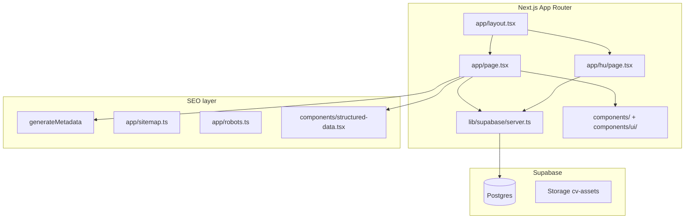

# Target architecture — Next + shadcn + Supabase

## System context



## Proposed folder layout (current on `v2`)

```
cv/
├── app/
│   ├── layout.tsx, page.tsx       # EN
│   ├── hu/page.tsx, hu/layout.tsx # HU
│   ├── not-found.tsx
│   ├── sitemap.ts, robots.ts
│   └── globals.css
├── components/
│   ├── ui/                        # shadcn
│   ├── locale-provider.tsx        # next-intl
│   ├── providers.tsx              # next-themes
│   └── …                          # section components
├── i18n/
│   ├── config.ts, request.ts
├── lib/cv/, lib/seo/, lib/supabase/
├── messages/en.json, messages/hu.json
├── content/*.yaml                 # seed source
├── scripts/
│   ├── seed-from-yaml.mts
│   ├── prepare-static-site.sh      # CI: local Supabase + generate
│   ├── prepare-static-site-prod.sh # publish: prod Supabase + generate
│   ├── supabase-push-prod.sh       # publish: link + db push
│   └── prepare-supabase-for-build.sh
├── supabase/migrations/
├── tests/e2e/
├── Dockerfile                     # Next build in Docker + nginx
├── nginx.conf
└── next.config.ts
```

## Rendering strategy

### Build-time fetch (required)

```typescript
// lib/cv/fetch.ts — called from Server Components at build time
export async function getCvProfile(slug: string, locale: 'en' | 'hu') {
  const supabase = createBuildClient();
  const { data, error } = await supabase
    .from('cv_profiles')
    .select('*, work_experiences(*), educations(*), skills(*), hobbies(*)')
    .eq('slug', slug)
    .single();
  if (error) throw error;
  return mapToCvModel(data, locale);
}
```

```typescript
// app/page.tsx
export const dynamic = 'force-static'; // or default static with generateStaticParams

export default async function Page() {
  const cv = await getCvProfile('gabor-pichner', 'en');
  return <CvPage cv={cv} locale="en" />;
}
```

### Rebuild on content change

| Trigger          | Action                                                        |
| ---------------- | ------------------------------------------------------------- |
| Content update   | `pnpm run db:seed` (prod) → **`v*` git tag** → `publish.yaml` |
| Manual           | `workflow_dispatch` on `publish.yaml` (if enabled)            |
| Supabase webhook | **Deferred** — optional future auto-deploy                    |

Full setup: [deploy.md](./deploy.md).

Do **not** use `dynamic = 'force-dynamic'` for the public CV route.

## Static export (GitHub Pages)

| Setting              | Value                       |
| -------------------- | --------------------------- |
| `output`             | `'export'`                  |
| `images.unoptimized` | `true`                      |
| Build output         | `out/`                      |
| Hosting              | GitHub Pages via Actions    |
| Branch               | `v2` until cutover → `main` |

Vercel / ISR: **not in scope** (decision locked).

## Environment variables

| Variable                    | Scope                  | Purpose                                                           |
| --------------------------- | ---------------------- | ----------------------------------------------------------------- |
| `NEXT_PUBLIC_SITE_URL`      | Build + client         | Canonical, OG, JSON-LD                                            |
| `SUPABASE_URL`              | Build                  | Supabase project URL                                              |
| `SUPABASE_SERVICE_ROLE_KEY` | Build only (CI secret) | Full read for static generation                                   |
| `NEXT_PUBLIC_GA_ID`         | Production             | Analytics                                                         |
| `SUPABASE_ANON_KEY`         | Future admin only      | Not needed for public static build if using service role at build |

Never expose service role key to the browser.

### Local vs cloud URLs

| Environment     | `SUPABASE_URL`              | Docs                                     |
| --------------- | --------------------------- | ---------------------------------------- |
| Local dev       | `http://127.0.0.1:54321`    | [local-supabase.md](./local-supabase.md) |
| CI / production | `https://<ref>.supabase.co` | GitHub Secrets                           |

## i18n

**Implemented:** `next-intl` without `[locale]` routing (required for
`output: 'export'` with `/` + `/hu`).

| URL   | Locale | Content                               |
| ----- | ------ | ------------------------------------- |
| `/`   | `en`   | `cv.*.en` fields + `messages/en.json` |
| `/hu` | `hu`   | `cv.*.hu` fields + `messages/hu.json` |

Per-route `LocaleProvider` + `setRequestLocale` in `app/page.tsx` and
`app/hu/layout.tsx`.

## Styling

```
Tailwind v4 (globals.css)
  └── shadcn/ui theme tokens (--background, --primary, …)
        └── Section components (Tailwind utilities only)
```

No SCSS. Design tokens live in `app/globals.css` (shadcn CSS variables + `.cv-*`
helpers).

## CI

**Package manager:** pnpm — `pnpm install --frozen-lockfile` in CI; lockfile
`pnpm-lock.yaml`.

| Job        | Command                                             |
| ---------- | --------------------------------------------------- |
| Install    | `pnpm install --frozen-lockfile`                    |
| Lint       | `pnpm run lint`                                     |
| Typecheck  | `pnpm run typecheck`                                |
| Build      | `prepare-static-site.sh` — **local** Supabase in CI |
| E2E        | Playwright on `out/`                                |
| Lighthouse | `.lighthouserc.json` thresholds                     |
| Docker     | `docker-build-env` — **local** Supabase smoke build |

**Publish** (`v*` tag): `supabase-push-prod.sh` → `prepare-static-site-prod.sh`
/ prod `Dockerfile` build-args (cloud Supabase).

Local quality gate:
`pnpm install && pnpm run lint && pnpm run typecheck && pnpm run build`.

## Cutover

1. Lighthouse + E2E green on `v2` branch
2. Merge `v2` → `main`
3. Update deploy workflow branch triggers (`v2` → `main`)
4. GitHub Pages continues via Actions; custom domain unchanged
5. Archive Nuxt code; update `docs/.ai/architecture.md`
