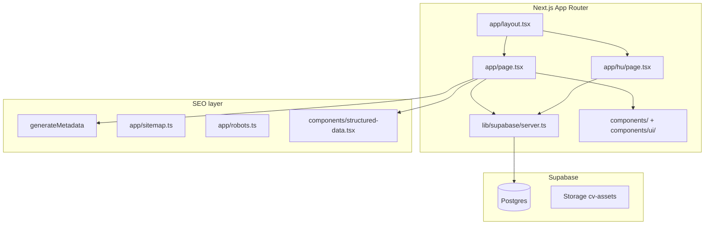

# Target architecture — Next + shadcn + Supabase

## System context



## Proposed folder layout

```
cv/                          # rewrite on `v2` branch
├── app/
│   ├── layout.tsx           # fonts, theme provider, global shell
│   ├── page.tsx             # EN CV (default locale)
│   ├── hu/
│   │   └── page.tsx         # HU CV (or [locale] dynamic segment)
│   ├── sitemap.ts
│   ├── robots.ts
│   ├── llms.txt/route.ts    # or public/llms.txt
│   └── globals.css          # Tailwind + shadcn CSS variables
├── components/
│   ├── ui/                  # shadcn primitives (button, card, badge, …)
│   ├── header.tsx
│   ├── experience.tsx
│   ├── education.tsx
│   ├── skills.tsx
│   ├── hobbies.tsx
│   ├── language-selector.tsx
│   ├── structured-data.tsx
│   └── cookie-consent.tsx
├── lib/
│   ├── supabase/
│   │   ├── server.ts        # service role / anon for build
│   │   └── types.ts         # generated Database types
│   ├── cv/
│   │   ├── fetch.ts         # getCvProfile(slug, locale)
│   │   └── types.ts         # CV domain types (from current Zod)
│   └── site-config.ts
├── messages/
│   ├── en.json
│   └── hu.json
├── public/
│   └── grid.svg             # static assets not in Supabase Storage
├── supabase/
│   ├── config.toml
│   ├── migrations/
│   └── seed.sql
├── tests/                   # Playwright
├── docs/
└── next.config.ts
```

## Rendering strategy

### Build-time fetch (required)

```typescript
// lib/cv/fetch.ts — called from Server Components at build time
export async function getCvProfile(slug: string, locale: 'en' | 'hu') {
  const supabase = createBuildClient();
  const { data, error } = await supabase
    .from('cv_profiles')
    .select('*, work_experiences(*), educations(*), skills(*), hobbies(*)')
    .eq('slug', slug)
    .single();
  if (error) throw error;
  return mapToCvModel(data, locale);
}
```

```typescript
// app/page.tsx
export const dynamic = 'force-static'; // or default static with generateStaticParams

export default async function Page() {
  const cv = await getCvProfile('gabor-pichner', 'en');
  return <CvPage cv={cv} locale="en" />;
}
```

### Rebuild on content change

| Trigger                | Action                                                                           |
| ---------------------- | -------------------------------------------------------------------------------- |
| Supabase DB row change | Webhook → GitHub `repository_dispatch` (`supabase-cv-updated`) → deploy workflow |
| Push to `v2`           | Deploy workflow (during migration)                                               |
| Manual                 | `workflow_dispatch` on deploy workflow                                           |
| Tag `v*`               | Release deploy (post-cutover, optional)                                          |

Full setup: [deploy.md](./deploy.md).

Do **not** use `dynamic = 'force-dynamic'` for the public CV route.

## Static export (GitHub Pages)

| Setting              | Value                       |
| -------------------- | --------------------------- |
| `output`             | `'export'`                  |
| `images.unoptimized` | `true`                      |
| Build output         | `out/`                      |
| Hosting              | GitHub Pages via Actions    |
| Branch               | `v2` until cutover → `main` |

Vercel / ISR: **not in scope** (decision locked).

## Environment variables

| Variable                    | Scope                  | Purpose                                                           |
| --------------------------- | ---------------------- | ----------------------------------------------------------------- |
| `NEXT_PUBLIC_SITE_URL`      | Build + client         | Canonical, OG, JSON-LD                                            |
| `SUPABASE_URL`              | Build                  | Supabase project URL                                              |
| `SUPABASE_SERVICE_ROLE_KEY` | Build only (CI secret) | Full read for static generation                                   |
| `NEXT_PUBLIC_GA_ID`         | Production             | Analytics                                                         |
| `SUPABASE_ANON_KEY`         | Future admin only      | Not needed for public static build if using service role at build |

Never expose service role key to the browser.

### Local vs cloud URLs

| Environment     | `SUPABASE_URL`              | Docs                                     |
| --------------- | --------------------------- | ---------------------------------------- |
| Local dev       | `http://127.0.0.1:54321`    | [local-supabase.md](./local-supabase.md) |
| CI / production | `https://<ref>.supabase.co` | GitHub Secrets                           |

## i18n

**Target:** match current `prefix_except_default`.

| URL   | Locale | Content                               |
| ----- | ------ | ------------------------------------- |
| `/`   | `en`   | `cv.*.en` fields + `messages/en.json` |
| `/hu` | `hu`   | `cv.*.hu` fields + `messages/hu.json` |

Options:

1. **`next-intl`** with `[locale]` segment — recommended for UI strings
2. Duplicate `app/page.tsx` + `app/hu/page.tsx` — minimal, works for two locales

## Styling

```
Tailwind v4 (globals.css)
  └── shadcn/ui theme tokens (--background, --primary, …)
        └── Section components (Tailwind utilities only)
```

No SCSS. Port design tokens from `app/assets/styles/_variables.scss` to shadcn
CSS variables.

## CI (target)

**Package manager:** pnpm — `pnpm install --frozen-lockfile` in CI; lockfile
`pnpm-lock.yaml`.

| Job        | Command                                                         |
| ---------- | --------------------------------------------------------------- |
| Install    | `pnpm install --frozen-lockfile`                                |
| Lint       | `pnpm run lint`                                                 |
| Typecheck  | `pnpm run typecheck`                                            |
| Build      | `pnpm run build` (with Supabase secrets)                        |
| E2E        | `pnpm exec playwright test` against `out/` via `pnpm dlx serve` |
| Lighthouse | Same thresholds as `.lighthouserc.json`                         |

Local quality gate:
`pnpm install && pnpm run lint && pnpm run typecheck && pnpm run build`.

## Cutover

1. Lighthouse + E2E green on `v2` branch
2. Merge `v2` → `main`
3. Update deploy workflow branch triggers (`v2` → `main`)
4. GitHub Pages continues via Actions; custom domain unchanged
5. Archive Nuxt code; update `docs/.ai/architecture.md`
