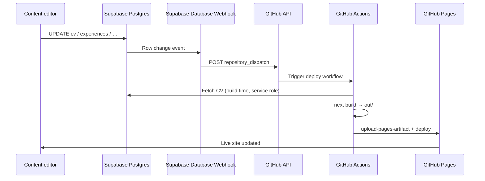
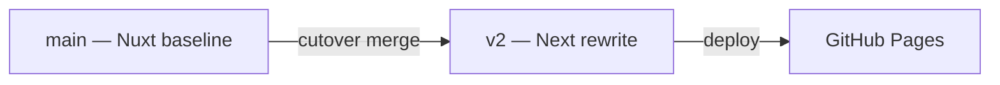

# Deploy — GitHub Pages, `v2` branch, Supabase webhook

## Decisions (locked)

| Topic           | Decision                                                     |
| --------------- | ------------------------------------------------------------ |
| Hosting         | **GitHub Pages** — static HTML only                          |
| Branch          | **`v2`** — all rewrite work until cutover                    |
| Content rebuild | **Supabase Database Webhook → GitHub `repository_dispatch`** |
| Next output     | `output: 'export'` → deploy `out/` directory                 |
| Package manager | **pnpm** on `v2` (`pnpm-lock.yaml`)                          |

## End-to-end flow



Manual fallback: `workflow_dispatch` on the same deploy workflow.

## GitHub Pages + Next.js static export

### `next.config.ts`

```typescript
const nextConfig = {
  output: 'export',
  images: { unoptimized: true }, // required for static export
  // basePath: only if site is served from subpath (not needed for 95gabor.me root)
};
```

### Build output

| Current (Nuxt)                                       | Target (Next)                          |
| ---------------------------------------------------- | -------------------------------------- |
| `npm run generate` → `.output/public` (Nuxt, `main`) | `pnpm run build` → `out/` (Next, `v2`) |

### Custom domain

Keep existing `95gabor.me` → GitHub Pages CNAME. No `basePath` when deploying to
domain root.

### GitHub Pages settings (repo)

| Setting           | Value                                               |
| ----------------- | --------------------------------------------------- |
| Source            | GitHub Actions                                      |
| Production branch | `v2` (during migration); `main` after cutover merge |

## `v2` branch strategy



| Phase        | `main`                          | `v2`                                |
| ------------ | ------------------------------- | ----------------------------------- |
| Rewrite      | Unchanged Nuxt; live production | Next + Supabase; CI + Pages preview |
| Cutover      | Merge `v2` → `main`             | Becomes production source           |
| Post-cutover | Next stack; tag releases        | Delete or keep as archive           |

### CI during migration

- **PRs target `v2`** (not `main`) for rewrite work
- `main` keeps existing Nuxt CI until cutover
- Optional: deploy Pages preview only from `v2` pushes

### Cutover checklist

1. Lighthouse + E2E green on `v2`
2. Merge `v2` → `main`
3. Update workflows: default branch triggers, Pages deploy branch
4. Tag `v*` release on `main`
5. Archive/remove Nuxt app code in follow-up PR if desired

## Supabase → GitHub webhook

### Supabase side

Create **Database Webhooks** (Dashboard → Database → Webhooks) on tables that
affect the public CV:

| Table              | Events                 |
| ------------------ | ---------------------- |
| `site_config`      | INSERT, UPDATE, DELETE |
| `cv_profiles`      | INSERT, UPDATE, DELETE |
| `work_experiences` | INSERT, UPDATE, DELETE |
| `educations`       | INSERT, UPDATE, DELETE |
| `skills`           | INSERT, UPDATE, DELETE |
| `hobbies`          | INSERT, UPDATE, DELETE |

Alternatively: one webhook on `cv_profiles` only if child tables always update
`cv_profiles.updated_at` via trigger (simpler, fewer webhooks).

**Webhook HTTP request:**

```
POST https://api.github.com/repos/95gabor/cv/dispatches
Authorization: Bearer <GITHUB_PAT_OR_APP_TOKEN>
Accept: application/vnd.github+json
Content-Type: application/json

{
  "event_type": "supabase-cv-updated",
  "client_payload": {
    "table": "{{ table }}",
    "type": "{{ type }}"
  }
}
```

Store the GitHub token in Supabase **Vault** or webhook secret header — never
commit.

### GitHub side

New workflow `.github/workflows/deploy-pages.yml` (on `v2`, later `main`):

```yaml
name: Deploy Pages

on:
  repository_dispatch:
    types: [supabase-cv-updated]
  workflow_dispatch:
  push:
    branches: [v2] # remove or change to main after cutover
    tags: ['v*']

permissions:
  contents: read
  pages: write
  id-token: write

jobs:
  deploy:
    runs-on: ubuntu-24.04
    environment: github-pages
    steps:
      - uses: actions/checkout@v7
      - uses: pnpm/action-setup@v4
        with:
          version: 10
      - uses: actions/setup-node@v4
        with:
          node-version: '24'
          cache: pnpm
      - run: pnpm install --frozen-lockfile
      - run: pnpm run build
        env:
          SUPABASE_URL: ${{ secrets.SUPABASE_URL }}
          SUPABASE_SERVICE_ROLE_KEY: ${{ secrets.SUPABASE_SERVICE_ROLE_KEY }}
          NEXT_PUBLIC_SITE_URL: https://95gabor.me
      - uses: actions/configure-pages@v6
      - uses: actions/upload-pages-artifact@v5
        with:
          path: out
      - uses: actions/deploy-pages@v5
```

### GitHub secrets required

| Secret                      | Used by                                  |
| --------------------------- | ---------------------------------------- |
| `SUPABASE_URL`              | Build fetch                              |
| `SUPABASE_SERVICE_ROLE_KEY` | Build fetch (CI only)                    |
| `GITHUB_TOKEN` or PAT       | Supabase webhook → `repository_dispatch` |

For `repository_dispatch`, the token needs `contents` + `actions` scope (classic
PAT) or fine-grained repo **Contents: Read and write** + **Actions: Read and
write**.

### Debouncing (optional)

CV edits may fire multiple webhooks (bulk update). Options:

- Supabase trigger: bump single `cv_profiles.updated_at` once per transaction
- GitHub Actions `concurrency: group: pages-deploy, cancel-in-progress: true` —
  only latest deploy runs

## Lighthouse CI on `v2`

Update `.lighthouserc.json`:

```json
"startServerCommand": "npx --yes serve out -p 4173 -a 127.0.0.1"
```

## Docker (optional, post-cutover)

Current `publish.yaml` builds Docker from Nuxt `generate`. After rewrite:

- Dockerfile serves `out/` via nginx (same pattern as today)
- Keep tag-triggered Docker publish if still needed

## Related

- [architecture.md](./architecture.md) — app structure
- [phases.md](./phases.md) — Phase 5–6 deploy tasks
- [../next-shadcn-supabase-rewrite.md](../next-shadcn-supabase-rewrite.md) —
  project brief
