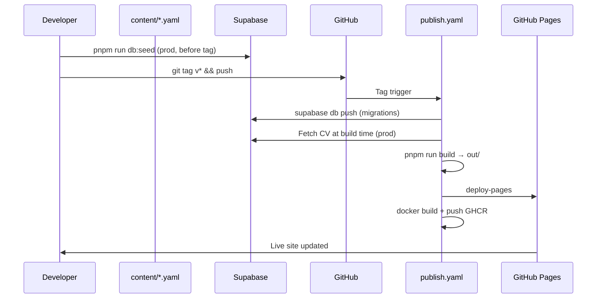

# Deploy — GitHub Pages, tag release, prod Supabase

## Decisions (locked)

| Topic           | Decision                                                    |
| --------------- | ----------------------------------------------------------- |
| Hosting         | **GitHub Pages** — static HTML only                         |
| Branch          | **`v2`** until cutover; then **`main`**                     |
| Content rebuild | **Manual `v*` git tag** → `publish.yaml` (webhook deferred) |
| Next output     | `output: 'export'` → deploy `out/` directory                |
| Package manager | **pnpm** (`pnpm-lock.yaml`)                                 |
| Docker image    | Root **`Dockerfile`** — Next build inside image + nginx     |

## End-to-end flow (current)



## GitHub Pages + Next.js static export

### `next.config.ts`

- `output: 'export'`
- `images.unoptimized: true`
- `next-intl` plugin via `i18n/request.ts`

### Build output

| Nuxt (`main`, legacy) | Next (`v2`)                 |
| --------------------- | --------------------------- |
| `.output/public`      | `out/` via `pnpm run build` |

### Custom domain

`95gabor.me` → GitHub Pages CNAME. No `basePath` at domain root.

### Workflows

| Workflow       | Trigger             | Purpose                                                          |
| -------------- | ------------------- | ---------------------------------------------------------------- |
| `ci.yaml`      | PR / push to `main` | Lint, typecheck, **local** Supabase build, E2E, LH, Docker smoke |
| `publish.yaml` | `v*` tag            | **Prod** migrations + Pages + GHCR Docker                        |
| `release.yaml` | `workflow_dispatch` | semantic-release (optional)                                      |

**CI** (`ci.yaml`): `CI=true bash scripts/prepare-static-site.sh` — local
Supabase + seed.

**Publish** (`publish.yaml`):

1. `scripts/supabase-push-prod.sh` — `link` + `db push` on cloud
2. Pages: `scripts/prepare-static-site-prod.sh` with `SUPABASE_*` secrets
3. Docker: `Dockerfile` build-args from prod secrets (no local Supabase)

**Publish credentials:** 1 secret (`SUPABASE_DB_URL`) + 2 variables
(`SUPABASE_URL`, `SUPABASE_PUBLISHABLE_KEY`) — see
[github-secrets.md](./github-secrets.md).

## Production Supabase seed

One-time (and when YAML changes):

```bash
supabase link --project-ref <ref>
pnpm run db:push    # or: supabase db push --linked

export SUPABASE_URL=https://<ref>.supabase.co
export SUPABASE_SECRET_KEY=<secret key from API Keys>
pnpm run db:seed
```

On `v*` tag, `publish.yaml` runs `db push` automatically. Seed remains manual
before tagging when YAML content changes.

Store secrets in **GitHub** for `publish.yaml`. Never commit service role keys
or DB passwords.

## `v2` branch strategy

| Phase        | `main`                         | `v2`                                |
| ------------ | ------------------------------ | ----------------------------------- |
| Rewrite      | Nuxt baseline; live production | Next + Supabase; active development |
| Cutover      | Merge `v2` → `main`            | Becomes production source           |
| Post-cutover | Next stack; tag releases       | Archive or delete                   |

### Cutover checklist

1. Lighthouse + E2E green on `v2`
2. Prod Supabase: `db push` + `db:seed`
3. GitHub Secrets for cloud Supabase
4. Merge `v2` → `main`
5. **Actions → Release** on `main` (semantic-release → `v*` tag → publish)
6. Remove Nuxt artifacts if any remain

## Supabase webhook (deferred)

Automatic rebuild on DB change is **not** required for v1. Content updates:

1. Edit YAML (or Studio) → `pnpm run db:seed` on prod
2. Push `v*` tag

Future option: Database Webhook → `repository_dispatch` — see git history of
this doc or Supabase Dashboard docs if enabling later.

## Docker

- **`Dockerfile`**: multi-stage — Node `pnpm run generate` + nginx with gzip
- **`docker-compose.yml`**: local prod-like preview on `:8000`
- **`nginx.conf`**: gzip, cache headers, `404.html` fallback

## Related

- [architecture.md](./architecture.md) — app structure
- [phases.md](./phases.md) — Phase 5–6 tasks
- [local-supabase.md](./local-supabase.md) — local vs cloud Supabase
- [../next-shadcn-supabase-rewrite.md](../next-shadcn-supabase-rewrite.md) —
  project brief
