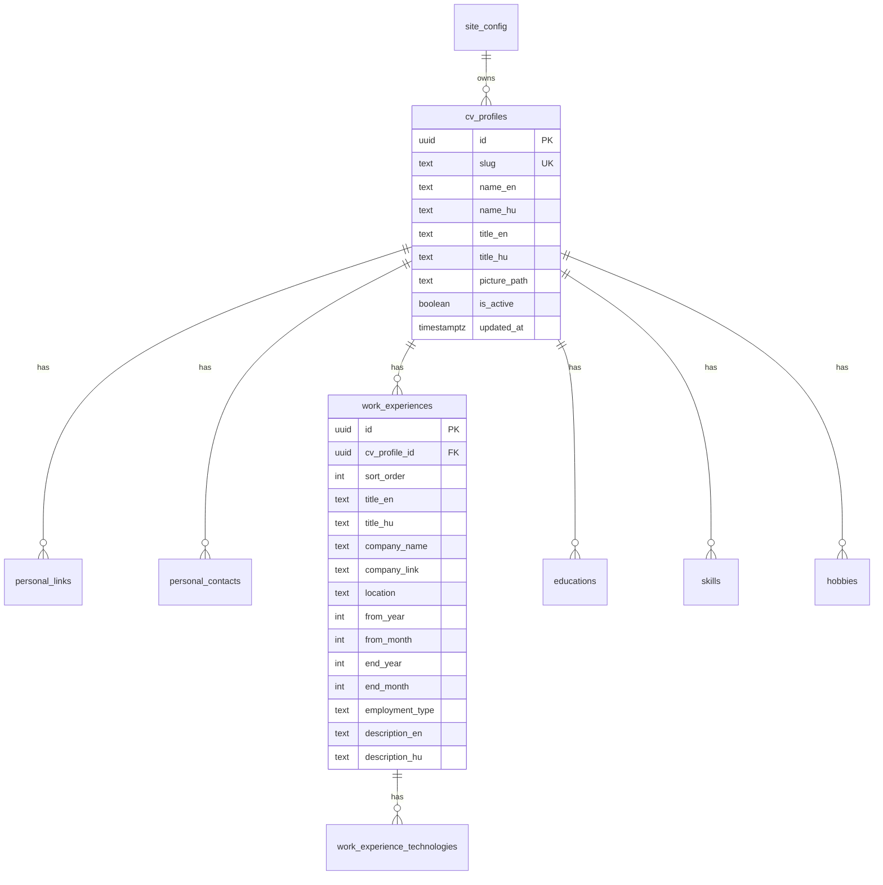
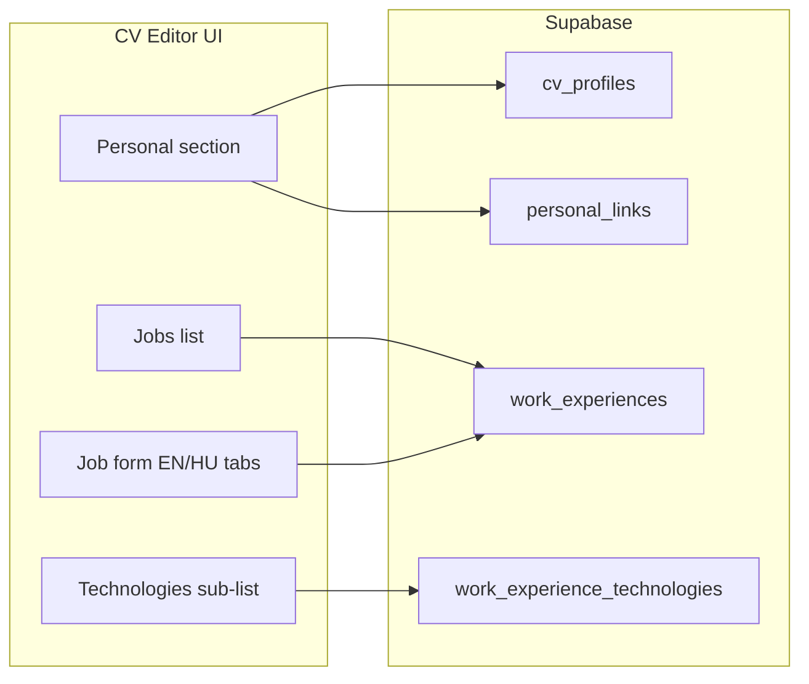

# Supabase schema — CV content model

Maps the current Zod schema (`app/types/cv.ts`) and `content/gabor-pichner.yaml`
to Postgres.

## Approach (locked)

**Editor-first hybrid** — structured tables for humans and developers, **no
single JSON/YAML document**.

| Audience       | Experience                                                              |
| -------------- | ----------------------------------------------------------------------- |
| CV editor (UI) | Forms, lists, drag-reorder — never raw JSON/YAML                        |
| Developers     | Readable SQL rows/columns in Supabase; typed fetch in `lib/cv/types.ts` |
| Public site    | Build-time fetch → same domain model as today                           |

### Why not a single JSONB blob?

A one-column `content jsonb` is fast to migrate but **bad for both goals**:
editors end up in a JSON panel; developers stare at an opaque blob.

### Why not fully normalized?

Separate `localized_strings` / translation tables add complexity without benefit
for **one CV** and two locales. Use **`_en` / `_hu` column pairs** instead —
readable and form-friendly.

### JSONB usage

Use JSONB **only** where unavoidable (none required in v1). Prefer explicit
columns and child tables.

## Entity diagram



## Tables

### `site_config`

Single row (`id = 'default'`).

| Column         | Type   | Editor UI             |
| -------------- | ------ | --------------------- |
| `url`          | text   | Site URL input        |
| `title`        | text   | SEO title             |
| `description`  | text   | Textarea              |
| `keywords`     | text[] | Tag input             |
| `favicon_path` | text   | File picker → Storage |

### `cv_profiles`

| Column                 | Type        | Editor UI                             |
| ---------------------- | ----------- | ------------------------------------- |
| `slug`                 | text UNIQUE | Read-only after create                |
| `name_en`, `name_hu`   | text        | Bilingual name fields                 |
| `title_en`, `title_hu` | text        | Bilingual job headline                |
| `picture_path`         | text        | Avatar upload → Storage               |
| `is_active`            | boolean     | Toggle (which profile the site loads) |
| `updated_at`           | timestamptz | Auto — webhook trigger source         |

### `personal_links`

| Column            | Type    | Editor UI                           |
| ----------------- | ------- | ----------------------------------- |
| `cv_profile_id`   | uuid FK | —                                   |
| `sort_order`      | int     | Drag handle                         |
| `platform`        | text    | Select / text (GitHub, LinkedIn, …) |
| `url`             | text    | URL input                           |
| `icon_dark_path`  | text    | Icon upload                         |
| `icon_light_path` | text    | Icon upload                         |

### `personal_contacts`

| Column          | Type      | Editor UI                       |
| --------------- | --------- | ------------------------------- |
| `cv_profile_id` | uuid FK   | —                               |
| `sort_order`    | int       | Drag handle                     |
| `type`          | text enum | location / phone / email / link |
| `value`         | text      | Text / URL input                |

### `work_experiences`

| Column                             | Type          | Editor UI                          |
| ---------------------------------- | ------------- | ---------------------------------- |
| `sort_order`                       | int           | Reorder jobs                       |
| `title_en`, `title_hu`             | text          | Bilingual                          |
| `company_name`                     | text          | Text                               |
| `company_link`                     | text nullable | URL                                |
| `location`                         | text          | Text                               |
| `from_year`, `from_month`          | int           | Date pickers                       |
| `end_year`, `end_month`            | int nullable  | “Current role” checkbox clears end |
| `employment_type`                  | text nullable | Select (maps to i18n key)          |
| `description_en`, `description_hu` | text          | Rich textarea / markdown           |

### `work_experience_technologies`

| Column               | Type    | Editor UI |
| -------------------- | ------- | --------- |
| `work_experience_id` | uuid FK | —         |
| `sort_order`         | int     | Reorder   |
| `name`               | text    | Text      |
| `link`               | text    | URL       |

### `educations`

Same pattern as jobs: `degree_en/hu`, `institution_name`, `institution_link`,
`location`, period columns, `note_en/hu` optional.

### `skills`

| Column       | Type          | Editor UI |
| ------------ | ------------- | --------- |
| `name`       | text          | Text      |
| `link`       | text nullable | URL       |
| `sort_order` | int           | Reorder   |

### `hobbies`

| Column               | Type          | Editor UI |
| -------------------- | ------------- | --------- |
| `name_en`, `name_hu` | text          | Bilingual |
| `link`               | text nullable | URL       |
| `sort_order`         | int           | Reorder   |

## UI editor → database mapping



**Editor rules:**

- Every user-visible field maps to **one column** (or one row in a child table).
- Bilingual content = **two inputs** (`_en`, `_hu`), not a JSON editor.
- Lists = **add / edit / delete / reorder** rows — never edit arrays as text.
- Save triggers `cv_profiles.updated_at` (via trigger on child tables) → webhook
  → redeploy.

## Developer readability

Example row developers see in Supabase:

```
work_experiences:
  title_en: "Full Stack Developer"
  title_hu: "Full Stack Fejlesztő"
  company_name: "it.hu"
  from_year: 2026
  from_month: 6
```

TypeScript layer maps flat columns → existing `CV` domain type
(`LocalizedString`, etc.) in `lib/cv/map-from-db.ts`. Public site and tests keep
the same shapes as `app/types/cv.ts`.

## Webhook / `updated_at`

Trigger on child tables bumps parent profile timestamp:

```sql
-- pseudocode: after insert/update/delete on work_experiences, educations, …
update cv_profiles set updated_at = now() where id = <cv_profile_id>;
```

Single Supabase Database Webhook on `cv_profiles` UPDATE is enough for rebuild.

## Storage

| Bucket      | Contents              |
| ----------- | --------------------- |
| `cv-assets` | Avatars, social icons |

Editor uploads file → Storage → saves path in `picture_path` / `icon_*_path`.

## RLS

| Role            | Policy                        |
| --------------- | ----------------------------- |
| `anon`          | SELECT published data         |
| `authenticated` | CRUD for editor (owner/admin) |
| `service_role`  | Build CI fetch only           |

## Seed migration

1. Parse `content/gabor-pichner.yaml` + `config.ts`
2. Insert into structured tables (not one JSON blob)
3. `lib/cv/map-from-db.ts` round-trip test against current Zod shapes

Run against **local self-hosted** stack (`supabase start`) during development;
push migrations to cloud for CI — see [local-supabase.md](./local-supabase.md).

## UI strings

Keep `messages/en.json` and `messages/hu.json` in git (section labels, buttons).
CV body content lives in Supabase.

## Future: CV Editor UI

Post–public-site-v1; schema is designed for it now.

| Screen           | CRUD target                                          |
| ---------------- | ---------------------------------------------------- |
| Personal         | `cv_profiles`, `personal_links`, `personal_contacts` |
| Experience       | `work_experiences`, `work_experience_technologies`   |
| Education        | `educations`                                         |
| Skills / Hobbies | `skills`, `hobbies`                                  |
| Site SEO         | `site_config`                                        |

Stack options: Next.js `/admin` route (auth via Supabase) or separate app — TBD.
